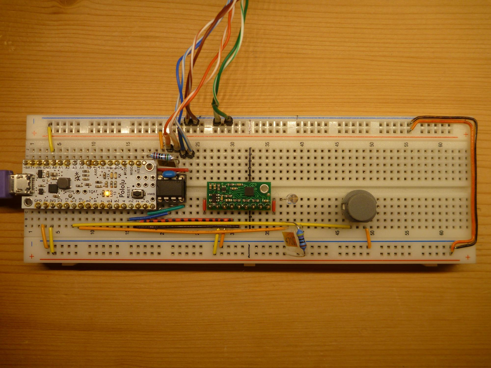

# LSM303_to_DMX
Arduino sketch to send LSM303 compass and accelerometer data as DMX data stream

you need an Arduino Leonardo compatible board (=HW USB and additional HW USART)

this sketch has some filtering for the raw data.
the accelerometer x, y, z and the heading is mapped to 0..255 and send as 4 dmx values.
additional there is 5th dmx value send - its static 42.

what values are send and in what format is easily adjustable.

